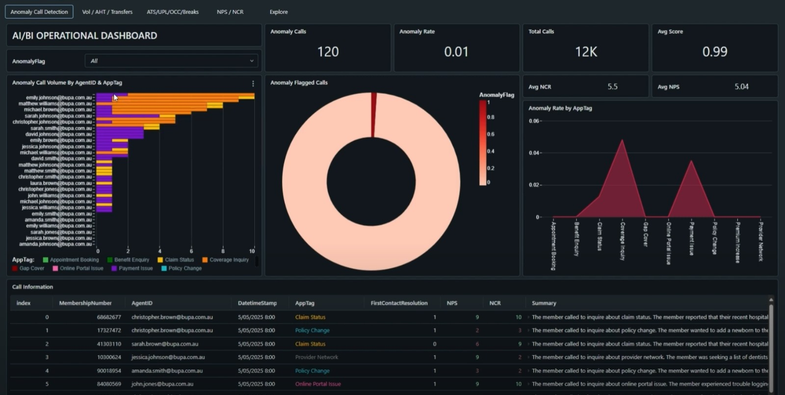

<table>
  <tr>
    <td></td>
    <td><h1 style="margin: 0;">Blue Bricks: Real-Time Sentiment & Anomaly Intelligence on Databricks</h1></td>
  </tr>
</table>

## Overview
Team Blue Bricks has built an advanced AI/BI solution on the Databricks Lakehouse Platform, transforming customer interactions into real-time, actionable intelligence. This platform continuously analyses sentiment signals, uncovers hidden customer distress, and enables rapid, proactive resolutions. Leveraging unified data analytics, Delta Lake's robust reliability, and Databricks' auto-scaling capabilities, our solution provides uninterrupted visibility into sentiment anomalies—empowering businesses to identify and address customer service risks before minor concerns escalate.

## Demo

Watch our complete AI/BI solution demonstration, showcasing the real-time sentiment analysis, anomaly detection dashboard, and AI-powered insights in action:

*Click the image above to watch the full demonstration of our Databricks-powered AI/BI solution.*

 
## How It Works
**Data Ingestion**  
Every four hours during contact centre operations, our system ingests call transcripts, customer sentiment signals, and post-call survey data directly into a Delta Lake architecture, ensuring ACID compliance, reliability, and minimal latency.
 
**AI-Driven Sentiment Analysis**  
Our solution employs a finely-tuned DistilBERT-SST2 transformer model. The model parses conversational transcripts, segmenting interactions from initial greetings to closing statements. It then assigns granular sentiment scores, computes an overall emotional trajectory to identify nuanced anomalies, particularly instances where superficially positive survey scores mask underlying customer distress.

**Real-Time Anomaly Detection**  
The system flags emotional discrepancies immediately, ensuring no critical customer interactions remain overlooked. Anomalies trigger real-time alerts, facilitating immediate investigation and intervention by customer service and operational teams.
 
**Interactive Operational Dashboard**  
Powered by Databricks SQL, our AI/BI Dashboard presents intuitive, interactive visualisations that highlight sentiment anomalies by agent, time, and enquiry type. Stakeholders receive actionable insights in near real-time, dramatically reducing response latency compared to traditional monthly reviews.
 
**Genie Natural-Language Interface**  
Integrated into Databricks' Genie Spaces, our AI-powered natural-language assistant allows operational specialists to query sentiment data effortlessly. Questions such as "Show recent sentiment anomalies" or "List affected service IDs" yield precise, instant answers, enabling swift action and operational agility.
 
## Impacts & Benefits  
**Risk Mitigation**  
Rapid detection of sentiment anomalies quickly surfaces underlying process gaps, training issues, or miscommunications. Organisations can address these proactively, preventing small issues from developing into major crises.
 
**Accelerated Resolution**  
With immediate access to timestamped transcripts, detailed sentiment analytics, and associated metadata, operations teams can swiftly retrain staff, correct misinformation, and directly reassure affected customers—all within hours rather than days.
 
**Enhanced Trust and Customer Loyalty**  
Proactive anomaly detection and transparent issue resolution turn potential customer grievances into powerful demonstrations of organisational care. This boosts customer satisfaction (NPS), reduces churn, and strengthens overall brand reputation.
 
**Scalable Intelligence**  
Utilising Databricks' auto-scaling compute clusters, collaborative notebook environments, and enterprise-grade security, our solution scales seamlessly across multiple regions, languages, and customer interaction channels. This ensures consistent and reliable performance, no matter the business scale or complexity.
 
## Our Commitment  
At Blue Bricks, we blend technological innovation with genuine empathy, ensuring customer voices are always heard. By harnessing the full potential of the Databricks Data Intelligence Platform, we empower businesses to transform every customer interaction into an opportunity for empathy, efficiency, and enduring customer relationships.
